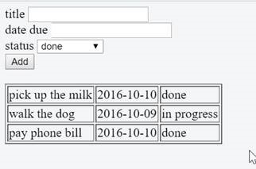

This project was generated with [Angular CLI](https://github.com/angular/angular-cli) version 11.2.4.

## Development server

Run `ng serve` for a dev server. Navigate to `http://localhost:4200/`. The app will automatically reload if you change any of the source files.

## Code scaffolding

Run `ng generate component component-name` to generate a new component. You can also use `ng generate directive|pipe|service|class|guard|interface|enum|module`.

## Build

Run `ng build` to build the project. The build artifacts will be stored in the `dist/` directory. Use the `--prod` flag for a production build.

---

# Antares Todos

This project was scaffolded from Angular CLI.

## Requirements:
```
This task is designed to be open ended and flexible as to match the working environment in an IT consulting company. You can do as much or as little as you deem necessary, but your entire solution will be considered.
 
Scope:
Create a simple TODO application using a web framework of your choice
You can run the code on StackBlitz https://stackblitz.com/ or CodePen -https://codepen.io/ 
Either send a link to the above sandbox solutions, or just email the resulting HTML, CSS and Javascript over when complete 
 
Background 
- A TODO item has the following fields
- Title – text field
- Date Due – date field
- Status – dropdown. Can select from values: “done”, “In progress” and “not started”
 
Mandatory
-  Must have the ability to add a new TODO item
-  Must have the ability to display all existing TODO items in a list
-  The TODO list can be saved in memory (doesn’t have to be persisted to a database of any sort)
 
Optional
-  The ability to delete TODO items
-  Validation checking such as Title must be mandatory, due date cannot be in the past
-  Use a date picker control during input of date values
 
Bonus Points
-  Use external libraries to make the controls look more modern
-  Use a front-end framework like Angular or React
-  Can you think of any data improvements to make the app more useful (eg. adding categories)
-  Can you think of any visual improvements to make the app more appealing (eg. animations, modern UI controls, drag & drop 
-  ???

```

### Sample expectation:
